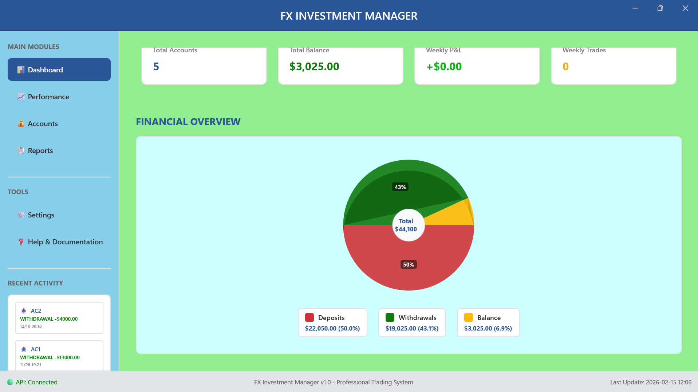
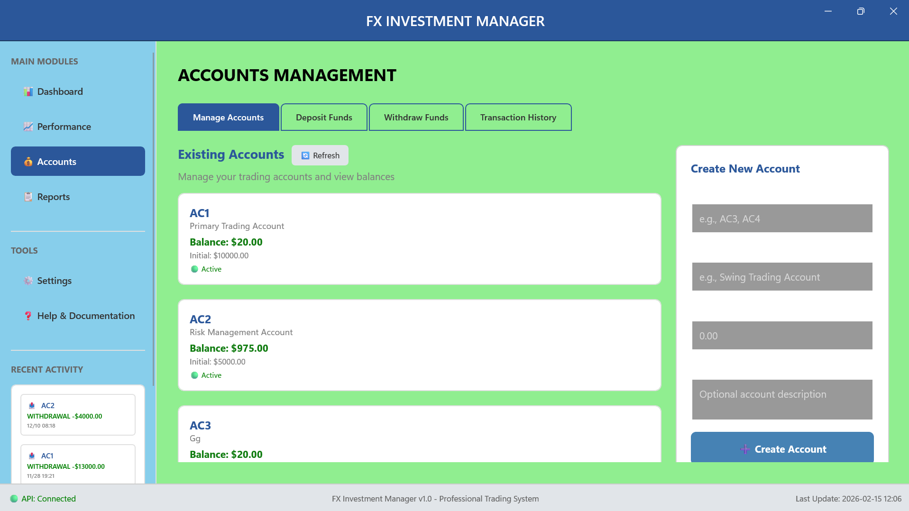
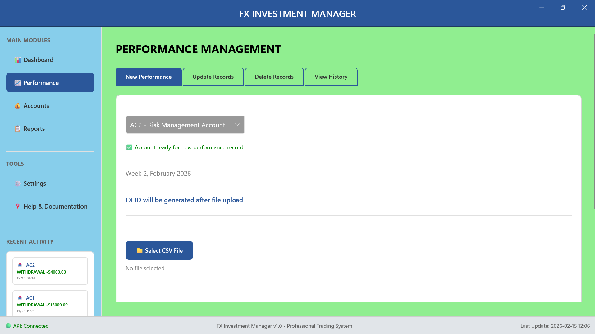
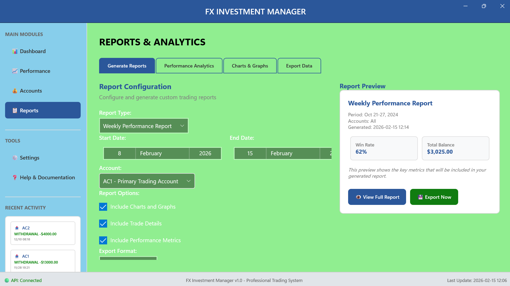

📈 Investment Portfolio Account Manager

C# Financial Portfolio Tracking & Performance Analysis System

## 📸 System Preview

  
  

  
  

---

📌 Overview

The Investment Portfolio Account Manager is a C#-based financial management system designed to track, analyze, and manage investment portfolios.

The application provides structured portfolio monitoring, asset allocation tracking, profit & loss calculation, and performance evaluation through a clean desktop interface.

It is designed to simulate real-world portfolio management logic used in brokerage and asset management systems.

---

🏗 System Architecture

User Interface (C# Desktop Application)
↓
Portfolio Management Layer
↓
Financial Calculation Engine
↓
Data Storage Layer (Local DB / MySQL / SQL Server depending on your setup)

The system separates business logic from presentation to maintain modularity and scalability.

---

🔹 Core Features

📊 Portfolio Management

Create and manage multiple investment accounts

Add, update, or remove assets (stocks, crypto, forex, etc.)

Track asset quantities and purchase prices

Manage transaction history

---

💰 Financial Calculations

Real-time profit and loss (P&L) calculation

Total portfolio valuation

Return on Investment (ROI) computation

Asset allocation percentage breakdown

Performance tracking over time

---

📈 Analytics & Reporting

Portfolio performance visualization

Gain/Loss summaries

Historical performance tracking

Risk exposure insights

Exportable reports (if implemented)

---

🧠 Business Logic

Average cost calculation

Position sizing logic

Portfolio diversification metrics

Investment growth tracking

Multi-asset support structure

---

⚙ Technology Stack

Language:

C#

Framework:

.NET (WinForms / WPF depending on your implementation)

Database:

SQL Server / MySQL / SQLite (adapt to your implementation)

Data Handling:

Structured financial computation logic

Object-oriented portfolio modeling

---

🔍 Functional Workflow

1. User creates an investment account.

2. Assets are added with purchase price and quantity.

3. System calculates:

Current portfolio value

Total investment capital

Unrealized and realized gains

4. Dashboard updates portfolio metrics.

5. Performance reports are generated.

---

🧮 Financial Modeling Concepts Implemented

ROI = (Current Value - Initial Investment) / Initial Investment

Weighted Average Cost per Asset

Portfolio Allocation Percentage

Capital Distribution Analysis

Profit/Loss Tracking per Position

---

🎯 Use Cases

Personal portfolio tracking

Investment strategy simulation

Financial modeling demonstration

Educational finance tool

Prototype for brokerage-style systems

---

🚀 Future Enhancements

Live market data API integration

Risk modeling (Volatility, Beta, Sharpe Ratio)

Automated performance charts

Cloud synchronization

Multi-user account support

Secure authentication & encryption

AI-based investment insights

---

🏆 Engineering Focus

This project demonstrates:

Financial data modeling

Business logic implementation

Desktop application architecture

Structured data management

Analytical computation systems

Performance evaluation logic

Clean UI/UX for financial systems

---

📊 Example Features Demonstrated

✔ Object-Oriented Design
✔ Financial computation engine
✔ Portfolio aggregation logic
✔ Real-time value tracking
✔ Modular code structure

---

🛠 How to Run

1. Open solution in Visual Studio

2. Restore dependencies

3. Configure database connection (if applicable)

4. Run application

---

📌 Project Objective

To design and implement a structured financial portfolio management system capable of modeling real-world investment tracking and performance analysis scenarios.

